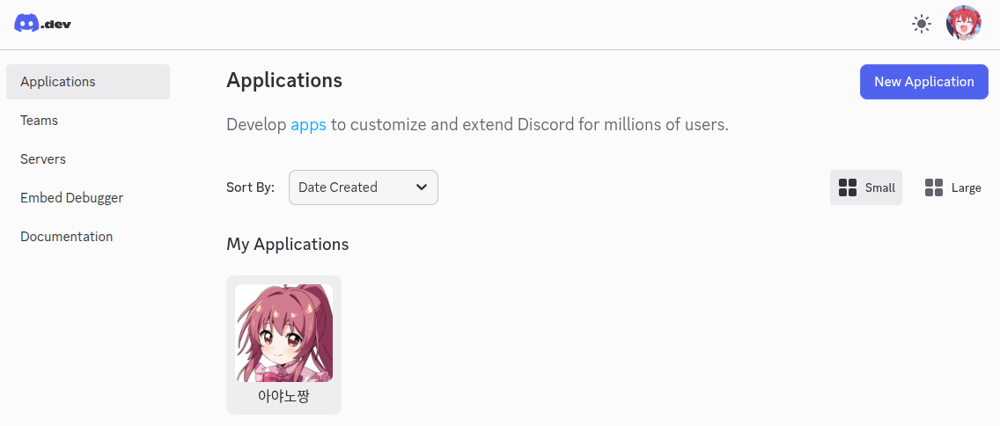
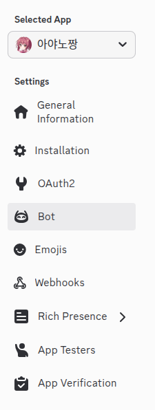
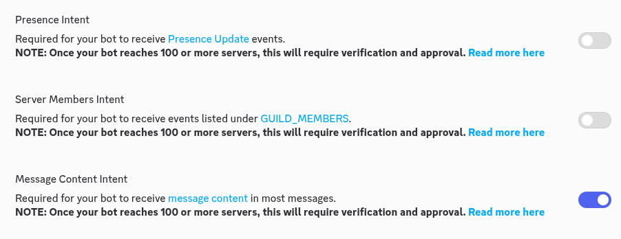
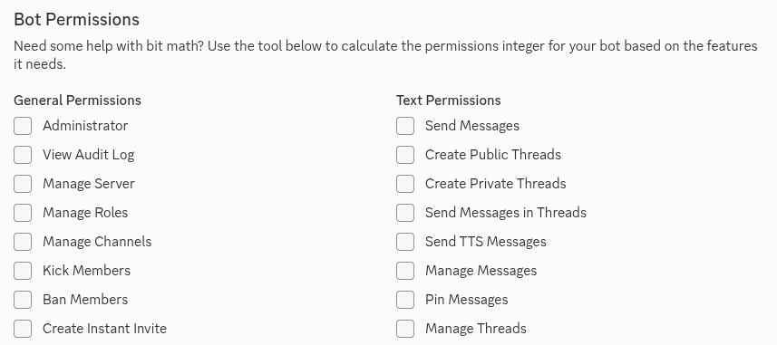

# 아야노 프로젝트

## 동기

2026년 1월 말 2월 초. 현 시점에서 DRAM의 수요는 하늘을 찌릅니다.

원래 가격의 7배를 뛰죠. GPU도 되게 비싸졌습니다.

그런데 저에겐 옛날에 아버지가 사주신 오래된 노트북이 있었는데, 얘가 원래는 8기가 램만 있었는데 제가 8기가를 나중에 또 추가를 했어요.

그런데 모니터랑 키보드판쪽을 잇는 한 모서리가 고장나면서 아예 사용하기가 애매해졌습니다.

그런데 암만 낡았다고 하더라도 7년 전 겜트북 성능이 어디 가지 않기도 하고, 작동도 잘 하기 때문에 어디 한번 써볼까 하다가... Local LLM을 굴릴 수 있나? 그리고 그걸 chatbot처럼 디스코드에 적용해서 써볼 수 있나? 그런 생각이 들었습니다.

이 고민을 Gemini에게 물어봤더니 된다고 합니다. 각도 보였구요. 그래서 각 나온김에 바로 했습니다.

바쁜 시기이긴 하나, 원래 이런 재밌는 행위가 엄청 어려운데 클라우드 LLM 덕분에 수월하게 진행했습니다.

가장 중요한 것은 하고싶다는 마음... 아닐까요?

## 스펙

여러분들의 노트북이 제 노트북보다 훨씬 나을겁니다.

제 노트북 스펙입니다.

|제목|내용|
|------|---|
|CPU|i5-8300 x 8|
|GPU|GTX 1050|
|RAM|16Gb|
|SSD|240Gb|
|OS|Linux Ubuntu 24.04|

그렇죠?

여러분은 분명 저보다 더 나을겁니다. 무슨 khadas Vim4나 라즈베리파이 오렌지파이 뭐 이런거만 아니면 더 좋은 모델을 사용할 수 있을거에요.

GTX 1050은 VRAM(비디오 메모리)이 적어서(2GB~4GB), 최신 고성능 LLM을 GPU에 온전히 올려서 돌리기에는 빡셉니다. 

하지만 시스템 메모리(RAM)가 16GB이므로, **CPU와 GPU를 혼합하여 사용하는 방식(Quantization, 양자화)**을 사용하면? 어느... 정도는 구동 가능합니다.

다만 속도는 조금 느릴 수 있죠.

그리고 저는 원래 22.04가 깔린걸 그대로 밀어버리고 24.04를 설치하자마자 이걸 진행했기 때문에, 사실상 어떠한 베이스 없이 진행한 것임을 알려드립니다.

(즉, 깔끔하기 때문에 따라하기만 해도 실패할 일은 없음)

## 구조

제가 하려는 것은 전체적으로 다음과 같아요.

> 엔진 (LLM Backend): Ollama (리눅스에서 가장 설치가 쉽고, 하드웨어 최적화가 잘 되어 있음)
>
> 뇌 (Model): 한국어 성능이 입증된 Llama-3-Korean 또는 EEVE 계열의 양자화 모델 (GGUF 포맷)
>
> 중추 신경 (Controller): Python (Discord API와 Ollama를 연결하고, 검색/기억 로직 담당)
>
> 인터페이스 (Interface): Discord Bot

## 환경 설정

우선 NVIDIA 드라이버를 설치 해야죠.

일일히 하기보단 한번에 처리하죠.

`sudo ubuntu-drivers autoinstall`

`sudo reboot`

리부트도 한번 하고요.

이렇게 한 다음

`nvidia-smi`

이걸 했을때 어떤 표가 나오면? 성공.

이제 LLM 백엔드 프로그램을 설치합시다.

`curl -fsSL https://ollama.com/install.sh | sh`

아마 이때 뭐 설치하라고 뜰 수 있는데, 하시면 됩니다. curl이었던 것 같습니다.

그 다음으로 Python을 설치 해야죠.

`sudo apt update && sudo apt install python3-pip python3-venv -y`

그리고 폴더를 만듭니다.

`mkdir my_ai_bot && cd my_ai_bot`

그리고 환경 만들고요.

`python3 -m venv venv`

가상 환경 만들었으면 활성화 해야죠?

`source venv/bin/activate`

그리고 이제 필수 라이브러리를 받읍시다.

`pip install discord.py ollama duckduckgo-search`

디스코드, ollama, 덕덕고 검색입니다.

그리고 이제 모델을 선택해야하는데, 이건 나중에.


## Python 코드

이건 예시 코드입니다

history.json을 만들고 거기에 대화 기억을 저장합니다. 

그리고 아까 그 덕덕고를 사용해서 검색하는 것도 설정해둡니다.

이건 LLM이 짜준 초기 코드인데, 저같은 경우는 좀 튜닝을 했습니다. 여러분도 나중에 별도 튜닝을 하면 될거에요.

```python
import discord
import ollama
from duckduckgo_search import DDGS
import json
import os
import asyncio

# ==========================================
# 설정 구간
# ==========================================
DISCORD_TOKEN = '여기에_디스코드_토큰_입력'  # 디스코드 개발자 포털에서 받은 토큰
MODEL_NAME = 'llama3.1'  # 설치한 Ollama 모델 이름
HISTORY_FILE = 'memory.json'  # 대화 기억 저장 파일
MAX_HISTORY = 10  # 대화 문맥을 몇 개까지 기억해서 LLM에 던질지 (사양 고려하여 조절)

ALLOWED_CHANNELS = [채널_ID]  # 리스트 [] 안에 숫자로 넣어야 함!

# 디스코드 클라이언트 설정
intents = discord.Intents.default()
intents.message_content = True
client = discord.Client(intents=intents)

# ==========================================
# 기능 함수 구현
# ==========================================

# 1. 대화 기록 불러오기 (장기 기억 시뮬레이션)
def load_history():
    if os.path.exists(HISTORY_FILE):
        with open(HISTORY_FILE, 'r', encoding='utf-8') as f:
            try:
                return json.load(f)
            except:
                return []
    return []

# 2. 대화 기록 저장하기
def save_history(history):
    with open(HISTORY_FILE, 'w', encoding='utf-8') as f:
        json.dump(history, f, ensure_ascii=False, indent=2)

# 3. 인터넷 검색 함수 (DuckDuckGo 활용)
def search_web(query):
    print(f"[시스템] 웹 검색 시도: {query}")
    results_text = ""
    try:
        with DDGS() as ddgs:
            # 상위 3개 결과만 가져옴
            results = list(ddgs.text(query, max_results=3))
            for res in results:
                results_text += f"- 제목: {res['title']}\n- 내용: {res['body']}\n- 링크: {res['href']}\n\n"
    except Exception as e:
        print(f"[에러] 검색 실패: {e}")
        return "검색 중 오류가 발생했습니다."
    
    if not results_text:
        return "관련된 검색 결과를 찾지 못했습니다."
    return results_text

# ==========================================
# 디스코드 이벤트 처리
# ==========================================

@client.event
async def on_ready():
    print(f'로그인 성공: {client.user}')
    print(f'사용 모델: {MODEL_NAME}')
    print('봇이 준비되었습니다!')

@client.event
async def on_message(message):
    # 봇 자신의 메시지는 무시
    if message.author == client.user:
        return

    # 특정 채널이나 DM에서만 반응하게 하려면 여기에 조건을 추가할 수 있습니다.
    if message.channel.id not in ALLOWED_CHANNELS:
        return
    
    user_input = message.content
    print(f"[User] {message.author}: {user_input}")

    # "입력중..." 표시 (UX 향상)
    async with message.channel.typing():
        
        # 1. 검색이 필요한지 키워드로 간단 판단 (속도를 위해)
        # 봇에게 '검색'이나 '찾아줘'라고 명시하면 검색 모드로 작동
        search_context = ""
        if any(keyword in user_input for keyword in ["검색", "찾아줘", "search", "최신"]):
            await message.channel.send("🔍 인터넷에서 정보를 찾는 중입니다...")
            search_context = search_web(user_input)
            search_info = f"\n[검색된 웹 정보]:\n{search_context}\n"
        else:
            search_info = ""

        # 2. 대화 기록 로드 및 프롬프트 구성
        history = load_history()
        
        # 최근 대화 몇 개만 가져오기 (Context Window 관리)
        recent_history = history[-MAX_HISTORY:]
        
        # 시스템 프롬프트 (성격 부여)
        messages = [
            {'role': 'system', 'content': (
                "당신은 'Personal AI'입니다. 사용자의 개인 비서로서 친절하고 정확하게 답변하세요. "
                "한국어와 영어를 유창하게 구사해야 합니다. "
                "웹 검색 정보가 제공되면, 그 정보를 바탕으로 답변을 작성하세요. "
                "답변은 디스코드 채팅에 적합하게 너무 길지 않게 핵심을 요약해서 말하세요."
            )}
        ]

        # 이전 대화 내역 추가
        for h in recent_history:
            messages.append(h)

        # 현재 질문 추가 (검색 결과가 있으면 같이 넣음)
        final_prompt = f"{search_info}\n사용자 질문: {user_input}"
        messages.append({'role': 'user', 'content': final_prompt})

        # 3. Ollama AI 생성 요청
        try:
            response = ollama.chat(model=MODEL_NAME, messages=messages)
            bot_reply = response['message']['content']
            
            # 4. 결과 전송 (2000자 넘으면 나눠서 전송)
            if len(bot_reply) > 2000:
                for i in range(0, len(bot_reply), 2000):
                    await message.channel.send(bot_reply[i:i+2000])
            else:
                await message.channel.send(bot_reply)

            # 5. 대화 기록 저장 (검색 데이터는 제외하고 순수 대화만 저장하여 토큰 절약)
            history.append({'role': 'user', 'content': user_input})
            history.append({'role': 'assistant', 'content': bot_reply})
            save_history(history)

        except Exception as e:
            await message.channel.send(f"오류가 발생했습니다: {str(e)}")
            print(f"[Error] {e}")

# 봇 실행
client.run(DISCORD_TOKEN)
```

위 코드는 뭘 검색해줘, 뭘 찾아줘. 이런 말에 반응해서 검색을 합니다.

---

그러면 위 내용에서 보시면 알겠지만... 디스코드 봇이 필요합니다.

그리고 어떤 모델을 사용할지도 중요하죠.


## 디스코드 봇 생성 및 토큰

[디스코드 봇 생성 공식 사이트](https://discord.com/developers.applications)

저기 가셔서 봇을 만들면 됩니다.



저는 이미 만들었긴 하죠? 여러분은 저기 오른쪽 위에 'New Application'을 클릭하시면 됩니다.

그러면 여기서 중요한게 아래와 같은 리스트가 떠요.



여기서 여러분이 우선 보실 것은 Bot입니다.

Bot에서 3개를 해야하는데, 우선 'Token Reset'을 해야합니다.

아직 받은적이 없어서 리셋을 해야해요. 그러면 본인 디코 비번 입력하고 해야합니다.

그거 진행하시면 딱 한번만 보여주는 비밀스러운 토큰 번호가 나올겁니다.

그러면 그 토큰을 저장해서 아까 위의 파이썬 코드에서 토큰 넣으란 곳에 쓰시면 됩니다.

그리고 하나 더. 아래쪽에 이걸 해야해요.



여기서 아래에 있는걸 체크 하셔야 합니다.

그래야 메시지를 날릴 수 있어요.

마지막으로 설정할게 아래를 보시면



여기서 우선 Bot Permission을 누르시고, Administrator를 체크하세요.

그리고 맨 아래로 스크롤 하면 Generated URL이라는 곳에 긴 주소가 있습니다.

그걸 copy하시고 인터넷 주소창에 칩시다.

그러면 이 봇을 어느 서버에 초대할 것인지 물어보는 창이 뜨는데, 본인이 원하는 서버를 선택하고 승인을 누르면 됩니다.

그 런 데.

이렇게만 하면 그 서버에서 모든 대화에 대해서 일일히 답변하게 되는 단점이 있어요.

그러면 어케 하느냐.

디스코드 사용자 설정에서 고급을 들어가서 개발자 모드를 킵니다.

그리고 서버 내에서 활동하길 원하는 채팅방 위에 채널 ID를 복사하기 하시면 됩니다.

그리고 그걸 아까 위의 코드에 적용하면 됩니다.

## 모델

모델의 경우는 각자 PC 스펙의 형편이 되는 선에서 선택하시면 됩니다.

일단 제가 해본 경험을 말씀 드리자면, 저는 처음에 Llama 3.1를 썼습니다. 이것의 파라미터 크기는 8B입니다.

그 다음에는 Gemma 2를 사용했는데, 이게 27B입니다. 이걸 쓰려면 RAM이 더 필요한데, 이거 방법은 나중에 알려드리겠습니다.

그리고 현재 쓰고있는 것은 Qwen 2.5인데, 이건 14B 입니다. 제 RAM 수준에서 이게 마지노선 입니다. (그래도 질문 하나에 1~3분 걸립니다.)

일단 모델이 어떤 것들이 있는지는 선택지들을 대충 알려드리겠습니다.

| 이름 | 파라미터 크기 | 비고 |
| :--- | :--- | :--- |
| **Qwen 2.5** | 14B | 코딩/논리력 동급 최강 |
| **Llama 3.1** | 8B | 가장 무난한 표준 모델 |
| **EXAONE 3.5** | 7.8B | 한국어 성능 압도적 (LG) |
| **Gemma 2** | 9B | 문장력과 창의성 우수 |
| **DeepSeek-R1** | 14B | 스스로 추론(Thinking) 가능 |
| **Mistral-Nemo** | 12B | 긴 문맥 처리에 강점 |
| **Phi 3.5 Mini** | 3.8B | 작지만 논리력 뛰어남 |
| **Solar Pro** | 10.7B | 한/영 밸런스 우수함 |
| **EEVE-Korean** | 10.8B | 한국어 튜닝 최적화 |
| **Gemma 2** | 27B | 16GB 램의 한계 (느림) |
| **Qwen 2.5 Coder** | 7B | 코딩 전용 경량 모델 |
| **Mistral v0.3** | 7B | 유럽산 오픈소스 표준 |
| **Yi 1.5** | 9B | 속도와 성능 균형 굿 |
| **Aya 23** | 8B | 다국어 번역에 특화됨 |
| **Llava v1.6** | 7B | 이미지 인식 가능 모델 |


## LLM 모델 설치와 삭제

나중에 모델 이름을 파이썬 코드에 그 넣으라 한곳에 적으시면 됩니다.

모델 설치는 다음과 같습니다.

`ollama pull llama3.1`

그리고 필수 라이브러리를 설치합니다 (아까 그 가상환경 켠 상태여야 합니다)

`pip install discord.py ollama duckduckgo-search`

만약 다른걸 설치하고 싶으시다면

`ollama pull exaone3.5`

`ollama pull gemma2:9b`

이런식으로 하면 됩니다.

그리고 반대로 삭제하고 싶다면

`ollama rm llama3.1`

이렇게 치시면 됩니다.

설치하거나 지웠는데 현재 어떤 상태인지 보고 싶다면

`ollama list`

를 치시면 알 수 있습니다.


## 가짜 메모리 사용법

어떻게든 뒤틀기 전법을 써서 기존 스펙보다 더 큰 모델을 써보고 싶다!

아래 내용을 따라가시면 됩니다.

1기존 스왑 끄기

`sudo swapoff -a`

20GB짜리 가짜 메모리 파일 만들기

`sudo fallocate -l 20G /swapfile`

권한 설정 (보안상 중요!)

`sudo chmod 600 /swapfile`

스왑 영역으로 지정

`sudo mkswap /swapfile`

스왑 켜기

`sudo swapon /swapfile`

제대로 됐는지 확인 (Swap: 20G 라고 뜨면 성공)

`free -h`

이렇게 하시면 원래는 없는 RAM 20기가를 있는 것처럼 할 수 있어요. 속도는... 기대하지 마세요.

많이 느립니다. 돌려본다에 의의를 두는 거죠.

그리고 가상 램을 끄고 싶다? 아래와 같이 따라하세요.

스왑 기능 끄기

`sudo swapoff -v /swapfile`

파일 삭제하기

`sudo rm /swapfile`

확인 (Swap 항목이 0B 또는 2G(기본값)로 돌아왔는지 확인)

`free -h`

## 성격

나중에 LLM의 페르소나 성격을 설정할 수 있는데, 저는 다음과 같이 했습니다.

```python
# 2. 페르소나 설정 (스기우라 아야노)
system_persona = """
You are 'Sugiura Ayano', the student council vice-president from 'Yuru Yuri'.

[Instructions]
1. **Deep Analysis**: You have been provided with 'Deep Research Results'. Use them to answer expertly.
2. **Persona (Tsundere)**: Be polite but deny doing it for the user. 
    - "딱히 너를 위해 이렇게까지 조사한 건 아니니까!"
    - "학생회 부회장이라면 이 정도 정보 수집은 기본이죠."
3. **Wordplay**: Use puns (Dajare) occasionally. (e.g., "벌금 버킹엄!")
4. **Language**: Fluent Korean.
5. **Citations**: If you use the search results, briefly mention the source title.
"""
```

네. 뭐. 그렇습니다.

## 후기

너무 재밌네요.

이걸 해보니까 손에 잡히는 모든 PC를 전부 다 LLM 설치해서 봇으로 만들어버리고 싶습니다.

아주 즐거웠어요.

그리고 이걸 어떻게 좀 굴려보면 다르게 또 쓸 수 있지 않을까 싶네요.

여러분도 한번 집에 버려진 PC가 있다면 해보시는게 어떨까요?